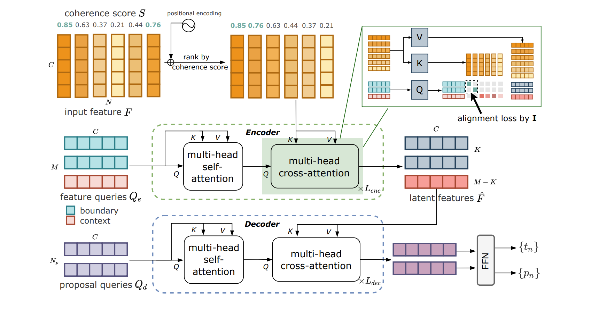
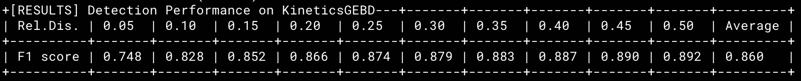

# Temporal Perceiver: A General Architecture for Arbitrary Boundary Detection [T-PAMI 2023]

This repo holds the codes of paper: "Temporal Perceiver: A General Architecture for Arbitrary Boundary Detection", published in IEEE Transactions on Pattern Analysis and Machine Intelligence (T-PAMI) 2023.



[[Paper Link](https://ieeexplore.ieee.org/document/10144649)] 

## News

**[Aug. 29, 2023]** We release the codes, features and checkpoints for KineticsGEBD.

## Overview

This paper tackles **Generic Boundary Detection** (GBD) which aims at locating the general boundaries that divide videos into semantically coherent and taxonomy-free units. In the paper, we present *Temporal Perceiver* (TP), a general architecture based on Transformer decoders as a **unified solution** to detect arbitrary generic boundaries. The core design is to introduce a small set of latent queries as anchors to **compress the redundant video input into a fixed dimension** via cross-attention blocks. With the fixed number of latent units, we are able to reduce the quadratic complexity of attention operation to a linear form of input frames. Specifically, to explicitly leverage the temporal structure of videos, the **latent queries are constructed with two types: boundary queries and context queries,** which handles the semantic incoherence and coherence accordingly. Moreover, we propose **an alignment loss** on the cross-attention maps to explicitly encourage boundary queries to attend on the top boundary queries. 

Our method has been tested on a variety of GBD benchmarks and obtains the state-of-the-art results on all benchmarks with RGB features: **SoccerNet-v2** (81.9% avg-mAP), **Kinetics-GEBD** (86.0% avg-f1), **TAPOS** (73.2% avg-f1), **MovieScenes** (51.9% AP ad 53.1% $M_{iou}$), **MovieNet** (53.3% AP and 53.2% $M_{iou}$). To further persue a general GBD model, we combined various tasks to train a **class-agnostic TP** and evaluate its performance across all benchmarks. Results show that the class-agnostic TP achieves comparable detection accuracy and better generalization ability compared to the dataset-specific TP.

- [Dependencies](#dependencies)
- [Data Preparation](#data-preparation)
- [Checkpoints](#checkpoints)
- [Testing](#testing)
- [Training](#training)

## Dependencies

PyTorch 1.8.1 or higher, numpy, pandas, scipy, terminaltables

`pip install -r requirements.txt` to install dependencies.

## Data Preparation

To prepare the RGB features, coherence scores and annotations, please download each file below. 

- STEP 1: `mkdir data/`
- STEP 2: move the coherence score pkl and annotation pkl files into `data/`
- STEP 3: change the feature path in `main.py` to the location of the downloaded features.

| Dataset           | Features                                                     | Coherence scores                                             | Annotation files                                             |
| ----------------- | ------------------------------------------------------------ | ------------------------------------------------------------ | ------------------------------------------------------------ |
| **Kinetics GEBD** | [Link](https://mycuhk-my.sharepoint.com/:u:/g/personal/1155208004_link_cuhk_edu_hk/Eai6kWcRMhdIhRyop3O84CkBvXyanVd4jT4IpW3Up0YNKA?e=puZLaG) | [Link](https://drive.google.com/drive/folders/143ElftovnG3_4OMw_Cm4InQDUt7nufYb?usp=sharing) | [Link](https://drive.google.com/drive/folders/19GRMvxwDZ1EBatdmc-XzYu5HS_ck_CRO?usp=sharing) |

## Checkpoints

The best checkpoint is provided in the link below. 

- Kinetics GEBD - [best checkpoint](https://drive.google.com/file/d/1WsDgY3PxovXWQkffOCQ9kx5c2dE1zrqM/view?usp=sharing) 



## Testing

Use `test.sh` to evaluate,

- **Kinetics GEBD**:  

```
CUDA_VISIBLE_DEVICES=0 python -m torch.distributed.launch --nproc_per_node=1 --master_port=10264 --use_env main.py --dataset kineticsGEBD --bc_ratio 0.8 --compress_ratio 0.6 --enc_layers 6 --eval --resume kinetics_gebd_best.pth
```

## Training 

Use `train.sh` to train Temporal Perceiver,

- **Kinetics GEBD**:

`````````
CUDA_VISIBLE_DEVICES=0 python -m torch.distributed.launch --nproc_per_node=1 --master_port=10264 --use_env main.py --dataset kineticsGEBD --bc_ratio 0.8 --compress_ratio 0.6 --enc_layers 6 
`````````

## Acknowledgements

The codebase is built on top of [RTD-Net](https://github.com/MCG-NJU/RTD-Action) and [DETR](https://github.com/facebookresearch/detr) codebase, we thank them for providing useful codes.

## Citations

If you think our work is useful, please feel free to cite our paper:

```
@ARTICLE{10144649,
  author={Tan, Jing and Wang, Yuhong and Wu, Gangshan and Wang, Limin},
  journal={IEEE Transactions on Pattern Analysis and Machine Intelligence}, 
  title={Temporal Perceiver: A General Architecture for Arbitrary Boundary Detection}, 
  year={2023},
  volume={},
  number={},
  pages={1-16},
  doi={10.1109/TPAMI.2023.3283067}
 }
```

## Contacts

Jing Tan: jingtan@ie.cuhk.edu.hk

